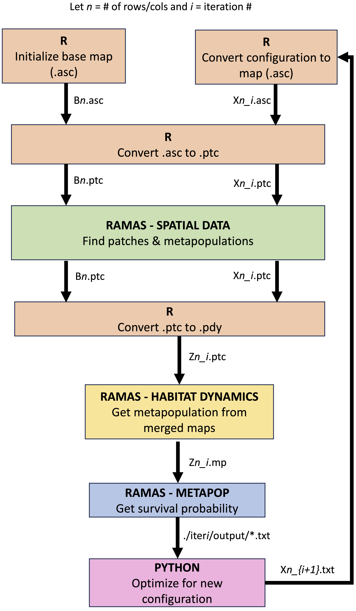

# Decision-Making for Land Conservation: A Derivative-Free Optimization Framework with Nonlinear Inputs

This software is a mathematical programming tool for conservationists that allows for linear and nonlinear inputs, continuous and discrete variables, and can be paired with existing ecological software.

We propose a derivative-free optimization framework paired with a nonlinear component, population viability analysis (PVA). Formulated as a mixed integer nonlinear programming (MINLP) problem, our model allows for linear and nonlinear inputs. In its current form, we have [RAMAS Metapopulation](https://www.ramas.com/metapop-6-0) PVA software as the input. RAMAS is commercial software that requires a license to use. Our code invokes RAMAS using batch files, so we are able to provide all the source code. However, unless RAMAS is installed on your machine, this code won't run. 

This repository includes our code, data, and [technical appendix](https://github.com/cassiebuhler/conservation-dfo/blob/main/technical-appendix.pdf).

Please refer to the paper for further details: https://arxiv.org/abs/2308.11549


## How to Use
Run *driver_.py*.

The following parameters can be changed in this file:

```
n = 10
cost =  np.array([random.randint(1,10) for j in range(n*n)])
tmax = 100 
numGen = 4

# Constrained "con" or Unconstrained "uncon"
modelType = "con" 
```

To change population parameters for PVA models, this can be changed in functions.R 

```
convertASCtoPTC <- function(path,landscapeType,n,iter){
 HS_threshold <- "0.50000"
 maxGrowthR <- 1.5
 
 carryingCapacity <- "ths*4"
 initAbund <- "ths*2"
 relFec <- "max(1,ths*1.2)"
 relSur <- "max(1,ths*1.2)"
 
 #Dispersal 
 disp_a <- "0.50"
 disp_b <- "0.80"
 disp_c <- "1.00"
 disp_d <- "1.00"
 
 #Correlation  
 cor_a <- "0.80"
 cor_b <- "2.00"
 cor_c <- "1.00"
 
 # CE (CEILING) BH (CONTEST) LO (SCRAMBLE)
 densityType = "LO" 
}
```

## Data 
The initial landscape $B$, was randomly generated consisting of values that are uniformly distributed from $[0,1]$ to represent the habitat suitability. 
  * This is generated in `functions.R` in the following snippet of code

```
getLandscape <- function(n,X) {
  set.seed(0) 
  r <- raster(xmn=0, xmx=n, ymn=0, ymx=n, ncol=n, nrow=n) #generate blank raster
  B <- runif(n*n,min=0,max=1)  #get habitat values for B 
  values(r) <- B #assign base habitat to raster 
  return(r) 
} 

```

## Dependencies
Code uses a combination of R, Python, and RAMAS. 

RAMAS
* [RAMAS GIS](https://www.ramas.com/gis-6-0) (Version 6.0)
* [RAMAS Metapopulation](https://www.ramas.com/metapop-6-0) (Version 6.0)

R package 
* [raster](https://cran.r-project.org/web/packages/raster/index.html) (Version 3.6-20)

Python packages 
* [pygmo](https://esa.github.io/pygmo2/) (Version 2.18.0)
* numpy 
* random 
* timeit
* os
* re
* subprocess


## Scripts
* `driver_.py`: Driver code that calls the optimization models
* `constrainedModel_.py`: Constrained model, equations (6) in the paper. Calls *getRAMAS* with current X. 
* `unconstrainedModel_.py`: Multi-objective model, equations (8) in the paper.  Calls *getRAMAS* with current X.
* `functions.R`: User-defined functions which output *.ASC, *.PTC, *.PDY, and *.BAT files that are necessary for RAMAS.
* `getMap.R`: Wrapper to *functions.R* 
* `runR.BAT`: Executes getMap.R
* `getRAMAS.py`: Calls runR.BAT to get RAMAS files, then invokes RAMAS and returns PVA metrics
* `getFigures.R`: Used to generate figures from the paper

## Directories
The results from the paper used 4 scenarios:

* `data/n10_con`: 10x10 landscape solved with constrained model.
* `data/n10_uncon`: 10x10 landscape solved with multi-objective model. $Z_m^*$ from the paper. 
* `data/n20_con`: 20x20 landscape solved with constrained model. $Z_c^*$ from the paper. 
* `data/n20_uncon`: 20x20 landscape solved with multi-objective model. $Z_m^*$ from the paper.
  
Note: Each iteration uses ~450 KB and with 2005 iterations for $n=20$ and 505 iterations for $n=10$, this would greatly exceed the allowed submission size of 100 MB. Thus, we have only included the base case $B$ and the best solution. 


* `data/n<n>_<model>`: All the data and PVA output for B
* `data/n<n>_<model>/iter<i>`: The data files for best $X^*$
* `data/n<n>_<model>/iter<i>/output`: PVA output for the best $X^*$

In addition, our technical appendix includes graphs of the PVA metrics for a specific problem. This problem can be found in ``data/n20_uncon/iter62``. 

## Figures 
All figures generated from `getFigures.R` are in this folder. 

## Results
* `output_n<n>_<model>.txt`: Output log of every X and its solution 
* `parameters.txt`: A text file of parameters for that problem. This is also detailed in the technical appendix. 

### RAMAS Files
One of the difficulties with using RAMAS is that file formats are specific to their software, and converting the files is done in their GUI. 
To call RAMAS from our code, we needed to use batch mode instead. This meant that we needed to manually write these text files in their specific format. 

**Refer to the technical appendix for a helpful flowchart**

We create the following files:

* `.ASC` Inputs habitat suitability map in RAMAS GIS: Spatial Data
* `.PCT` RAMAS GIS: Spatial Data file
* `.PDY` RAMAS GIS: Habitat Dynamics file


The files that are created after running RAMAS are:

After RAMAS GIS: Spatial Data is executed, the following are generated by RAMAS:
* `.P_H` Habitat suitability map in binary format
* `.RDCH` Habitat suitability map as an IDRISI raster document 
* `.P_S` Patch structure map in binary format
* `.RDCS` Patch structure map as an IDRISI raster document 
* `.SCL` Plotting data 


After RAMAS GIS: Habitat Dynamics is executed, the following are generated by RAMAS:
* `.MP` RAMAS: Metapopulation file
  
For each population, the following files are also created 
* `.FCH` temporal change in relative fecundities
* `.SCH` temporal change in relative survival rates 
* `.KCH` temporal change in carrying capacity

After RAMAS: Metapopulation is executed, the following text files are generated by RAMAS:
* `Abund`: Trajectory summary 
* `FinalStageN`: Final stage abundances 
* `Harvest`: Harvest summary
* `HarvestRisk`: Risk of low harvest
* `IntExpRisk`: Interval explosion risk 
* `IntExtRisk`: Interval extinction risk
* `IntPerDec`: Interval percentage decline
* `LocalOcc`: Local occupancy 
* `LocExtDur`: Local extinction duration 
* `MetapopOcc`: Metapopulation occupancy 
* `QuasiExp`: Time to quasi-explosion 
* `QuasiExt`: Time to quasi-extinction 
* `TerExpRisk`: Terminal explosion risk
* `TerExtRisk`: Terminal extinction risk
* `TerPerDec`: Terminal percentage decline 

The metrics we used are found in the files:
*  Expected minimum abundance (IntExtRisk)
*  Risk to extinction (TerExtRisk)
*  Time to extinction (QuasiExt)


For an illustration of the framework components and their corresponding file output, refer to the following flowchart:
<p align="center">
  
</p>


